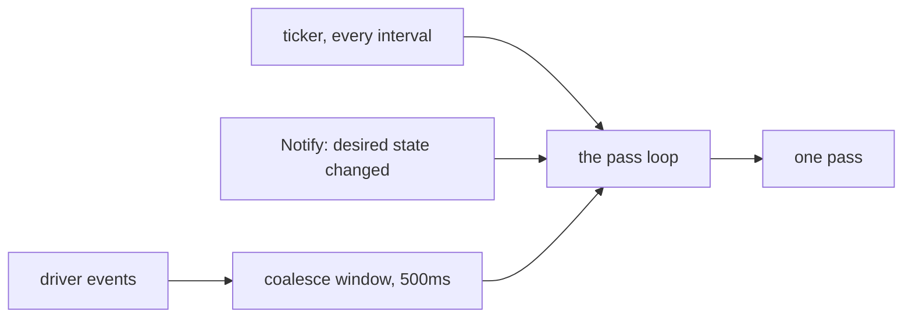
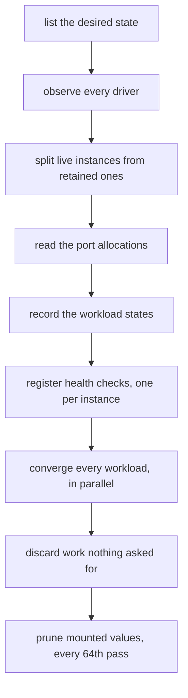
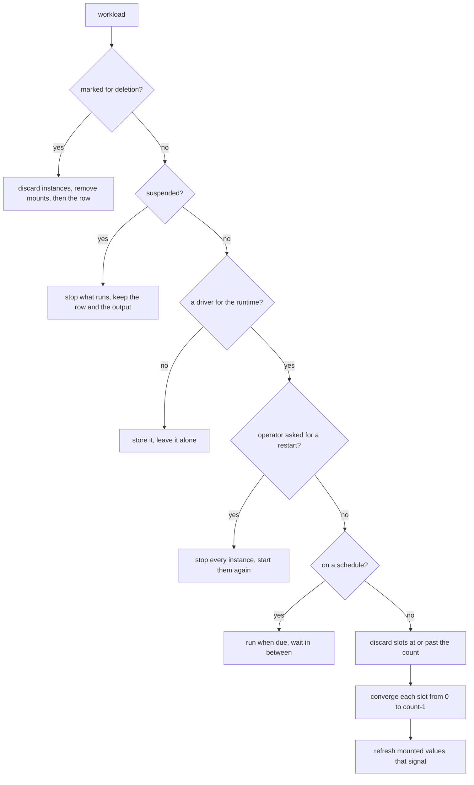
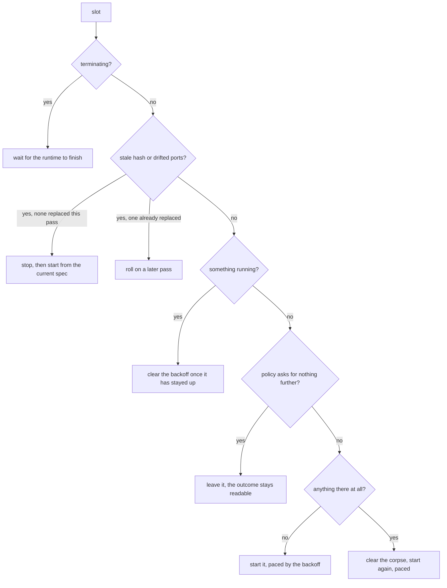
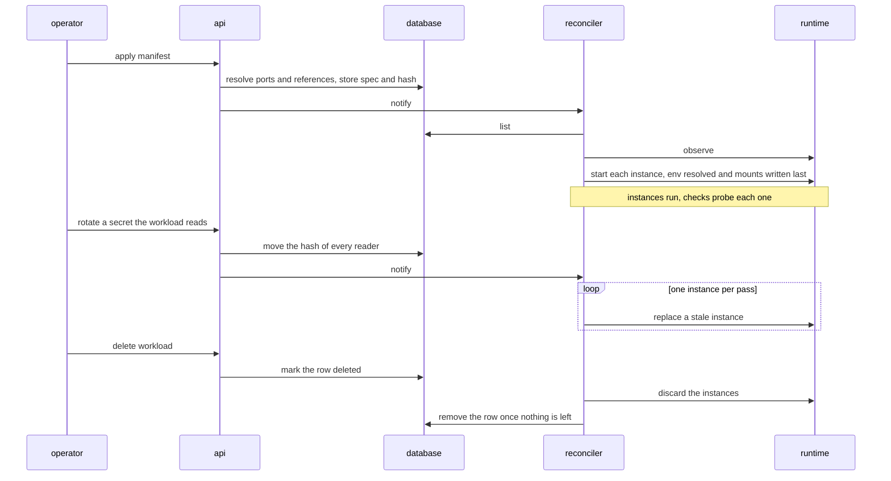

# Reconciliation

This is a walkthrough of the reconciler: when a pass runs, what one pass does, and
how a single workload moves through it. [Design](design.md) explains why the system
is built this way. This document explains how it behaves, close enough to the
mechanics to predict what the server will do next without reading the code.

The model is level-triggered. The database holds what should be running, the
drivers report what is running, and a pass acts on the difference. No pass depends
on the one before it: whatever a pass leaves unfinished, the next one finds again
by comparing the same two views. That is what makes a crash, a timeout or a
restart safe — nothing is lost that was not already written down.

## When a pass runs

Three things wake the loop:

- **The ticker.** Every reconcile interval — ten seconds by default, set under
  `[reconcile]` in the [configuration](configuration.md). This is the guarantee:
  whatever else fails, convergence is at most one interval away.
- **A notification.** The services call `Notify` when desired state changes — an
  apply, a rotation, a delete — so the pass that acts on it starts at once rather
  than at the next tick.
- **A driver event.** The runtimes report changes: a container dying, an exec
  process ending. An event does not run a pass alone — the events behind it are
  collected for half a second first, so a burst becomes one pass. A pass observes
  the whole runtime anyway, so the discarded events tell it nothing it will not
  see for itself.

Passes never overlap. Everything is driven from one goroutine, and a wake-up that
arrives during a pass coalesces into the next one. One pass also runs at startup,
so a workload applied before a restart is running again without waiting for the
first tick.

## What a pass does

The pass reads everything first: the workload rows, one observation per driver,
and the port allocations, each read once rather than once per workload. A driver
that does not answer within thirty seconds costs the pass rather than the node.

The observation is split into two views. A driver keeps the most recent stopped
container of each instance so its output stays readable — a retained instance has
ended and nothing will restart it, so convergence leaves it out. Orphan detection
is the opposite: a workload deleted while the server was down leaves only a
retained remnant, and one left out there would never be reaped.

Workloads then converge concurrently, bounded to the machine's CPU count with a
floor of four. Failures affect one workload: a converge that returns an error is
logged, recorded as the workload's `lastError`, and retried by the next pass.

## Converging one workload

Whole-workload questions are answered first, because they override whatever any
one instance is doing:

Some of those branches in more detail:

- **Teardown** removes things in a deliberate order: the runtime's work first,
  then the mounted values — a secret's plaintext must not outlive its reader —
  and the row last. While the row exists the workload reads as `terminating`, and
  a failure at any point leaves a workload the next pass tears down again.
- **Suspension** mirrors teardown without removing desired state. The row, the
  retained instance and its output stay, so what the workload last did remains
  readable while it is down.
- **A schedule** outranks the restart policy. An occurrence that is due replaces
  or skips a run still going, as the manifest's `overlap` says. Between
  occurrences only a failed run is retried — a clean one did what the occurrence
  asked.
- **A shrunk count** discards the slots past it, retained remnants included:
  nothing will read the output of an instance the count no longer asks for.

## Converging one instance

Everything else is decided per slot — each index from zero to `count - 1` is
observed, replaced, restarted and paced on its own, so one crashing instance
never touches its siblings.

**Staleness** is a comparison, not a memory. Every instance is stamped with the
hash of the specification it was started from. Each slot's expected hash is its
own: a workload reading another's address folds the addresses this instance
resolved into it, so a target's port moving replaces exactly the instances that
were reading it. An instance whose running ports no longer match its slot's rows
is stale by another route — it is bound to an address nothing records.

**Rolling** means at most one replacement of something running per workload per
pass. A change crosses a three-instance workload in three passes, which is what
makes replacing a counted workload a degradation rather than an outage. Slots
with nothing running are not held back by the roll.

**Health folds in before any of this.** An instance that is up but failing its
check reads as failed, so the same paced replacement path a crashed instance
takes also serves an unhealthy one. While a sibling still runs, the workload
lists as `degraded`.

## Pacing, and giving up

Restarts are paced per instance with exponential backoff: the manifest's restart
delay — one second by default — doubling on each consecutive failure up to a
ceiling of two minutes. An instance that stays up for ten seconds has worked, and
its backoff clears.

A manifest that sets `restart.attempts` puts a limit on the pacing. An instance
that reaches it is given up on: left exactly as it ended so the outcome stays
readable, counted once on the `takt_workload_giveups_total` metric, and started
again only by a specification change. Zero attempts — the default — means takt
keeps trying, which is what a long-running service wants.

Why a start failed is kept in memory as the workload's `lastError`, reported by
`takt workload get` until a pass over the workload succeeds. A failed start also
abandons the host ports takt chose for that instance — the port may be what the
start is failing on, and the next attempt tries different ones. Pinned ports are
left alone: they were asked for.

## The life of a workload

Two details of the start matter for what an operator observes. The environment is
resolved and the mounted values are written immediately before the driver is
handed the work, so a secret's plaintext lives no longer than it has to — and a
reference or value that cannot be resolved fails before the start, leaving the
instance's ports alone and the backoff pacing the retries. And the instance is
stamped with its slot's expected hash as it starts, which is the other half of
the staleness comparison above.

A rotation never rewrites the specification. Only the stored hash moves, the
running instances stop matching it, and the rolling replacement resolves the new
value as each instance starts. The workload's state through all of this is
derived, never stored — see the [state table](cli.md#workload-states) for what
each word means.
